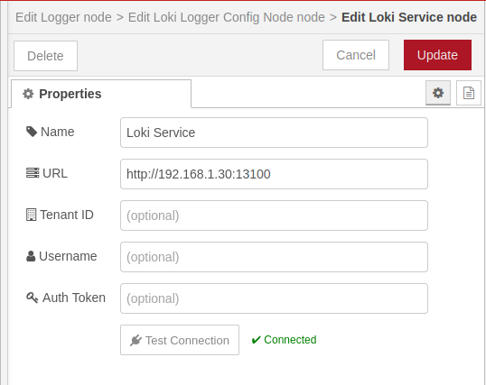
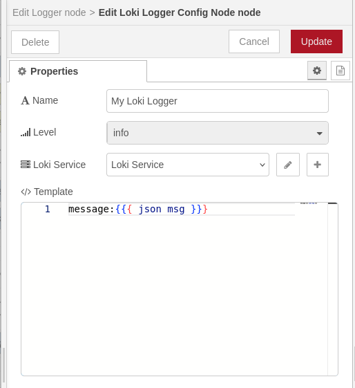
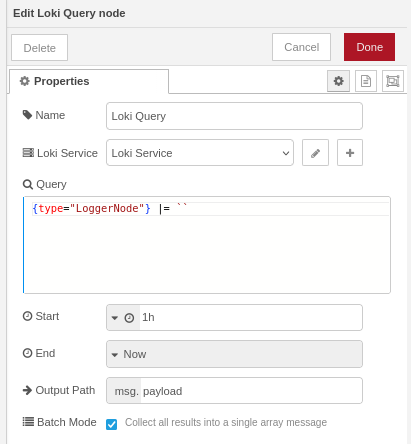
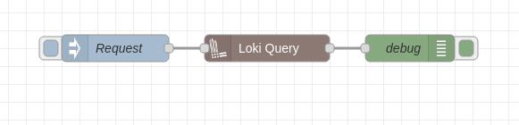

# @theotherwillembotha/node-red-loki

Grafana Loki integration for Node-RED. Built on [@theotherwillembotha/node-red-plugincore](https://github.com/theotherwillembotha/nodered_plugincore).

Provides three nodes:
- **Loki Service** - shared connection config (URL, auth, tenant ID)
- **Loki Logger** - ships structured log entries from any `@Logger`-decorated node directly to Loki
- **Loki Query** - executes a LogQL query and emits the results as Node-RED messages

---

## Installation

Either use the **Manage Palette** option in the Node-RED editor, or run the following command in your Node-RED user directory (typically `~/.node-red`):

```bash
npm install @theotherwillembotha/node-red-loki
```

> [!IMPORTANT]
> **This plugin requires [`@theotherwillembotha/node-red-plugincore`](https://github.com/theotherwillembotha/nodered_plugincore) to be installed.**
>
> `node-red-plugincore` is declared as a dependency and npm will install it automatically. However, due to a [known Node-RED limitation](https://github.com/node-red/node-red/issues/3529), transitive npm dependencies are only discovered by the Node-RED runtime on the **next startup**.
>
> **Two options:**
> - Install [`@theotherwillembotha/node-red-plugincore`](https://flows.nodered.org/node/@theotherwillembotha/node-red-plugincore) via the palette manager or `npm install` **first**, then install this plugin.
> - Install this plugin directly. `node-red-plugincore` installs alongside it. **Restart Node-RED once** and both packages will be fully loaded.

---

## Nodes

### Loki Service

Shared connection configuration referenced by both the Loki Logger and Loki Query nodes.



| Field | Description |
|-------|-------------|
| **Name** | Display label for this config node |
| **URL** | Base URL of your Loki instance, including port (e.g. `http://loki:3100`) |
| **Tenant ID** | Optional. Sent as the `X-Scope-OrgID` header for multi-tenant deployments. Leave blank for single-tenant mode. |
| **Username** | Optional username for basic authentication |
| **Auth Token** | Optional password or token for basic authentication |

The **Test Connection** button pings the Loki instance with the current settings and reports success or failure inline; no need to save first.

---

### Loki Logger

A logger config node that ships log entries from any node using the `@Logger` decorator directly to Loki over the HTTP push API.



| Field | Description |
|-------|-------------|
| **Name** | Display label for this config node |
| **Level** | Minimum log level: Debug, Info, Warning, or Error |
| **Loki Service** | The Loki Service config node to use for the connection |
| **Template** | Handlebars template that shapes each log line (e.g. `message:{{{json msg}}}`) |

The Loki Logger appears in the logger selector of any node built with the plugincore `@Logger` decorator.

---

### Loki Query

Executes a LogQL query against Loki on demand and emits the results as Node-RED messages.



| Field | Description |
|-------|-------------|
| **Name** | Display label for this node |
| **Loki Service** | The Loki Service config node to use for the connection |
| **Query** | LogQL query; edited in a Monaco editor with syntax highlighting and snippet completions |
| **Start** | Start of the time range. Accepts relative durations (`1h`, `30m`, `7d`) or absolute date strings |
| **End** | End of the time range. Defaults to **Now** |
| **Output Path** | Where in the output message to place each log line object. Defaults to `msg.payload` |
| **Batch Mode** | When enabled, all results are collected into a single array message. When disabled (default), one message is emitted per log line |

#### Query editor

The query field uses a Monaco editor with a custom LogQL language definition:
- Syntax highlighting for stream selectors `{app="nodered"}`, pipeline stages, metric functions, and aggregation operators
- Snippet completions for all major LogQL constructs ( trigger with `Ctrl+Space`)
- Auto-closing brackets and quotes

#### Time range

The **Start** and **End** fields accept:
- **Relative** - `1h`, `30m`, `7d`, `2w` (subtracted from now at query time)
- **Date/Time** - `2024-01-01T00:00:00Z` or any parseable date string

#### Output format

Each emitted message has the output path set to:
```json
{
  "timestamp": "2024-01-01T00:00:00.000Z",
  "line": "the log message text",
  "labels": { "app": "nodered", "level": "error" }
}
```

In **Batch Mode**, a single message is emitted with the output path set to an array of the above objects.

Results are capped at **1 000 log lines** or **10 MB** of response data, whichever is reached first.

#### Message overrides

| Property | Description |
|----------|-------------|
| `msg.query` | Overrides the configured LogQL query |
| `msg.start` | Overrides the configured start time |
| `msg.end` | Overrides the configured end time |

---

## Example

A simple flow that queries Loki on demand and outputs results to the debug panel:



A **Request** trigger fires the **Loki Query** node, which runs the configured LogQL query and passes each matching log line downstream to **debug**.

---

## Prerequisites

- Node.js 18+
- Node-RED 4+
- A running [Grafana Loki](https://grafana.com/oss/loki/) instance reachable from your Node-RED host

---

## Repository

- Source: [github.com/theotherwillembotha/nodered_loki](https://github.com/theotherwillembotha/nodered_loki)
- Issues: [github.com/theotherwillembotha/nodered_loki/issues](https://github.com/theotherwillembotha/nodered_loki/issues)

## License

[ISC](LICENSE)
